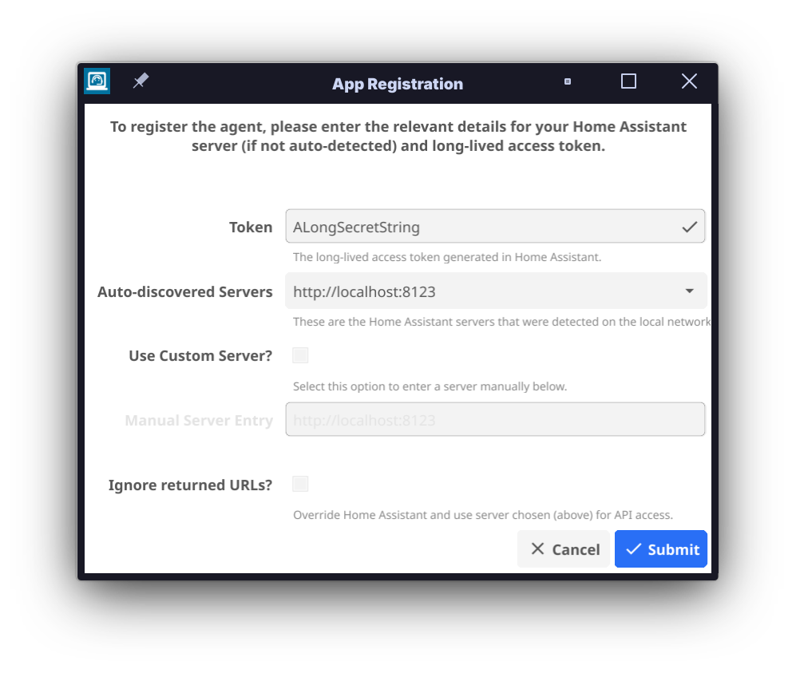
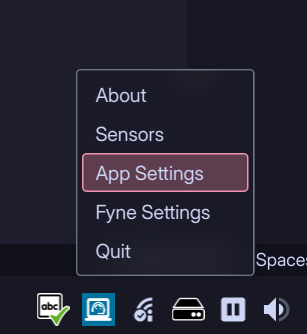
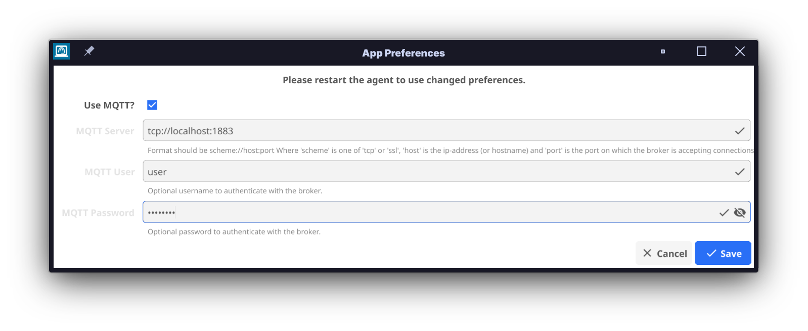
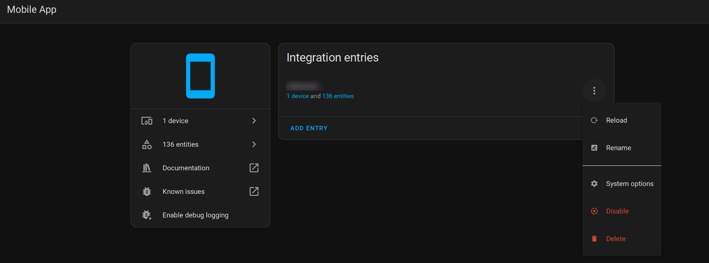

<!--
 Copyright 2024 Joshua Rich <joshua.rich@gmail.com>.
 SPDX-License-Identifier: MIT
-->

<div align="center">

  
  <h1>Go Hass Agent</h1>

  <p>
    A <a href="https://www.home-assistant.io/">Home Assistant</a>, <a href="https://developers.home-assistant.io/docs/api/native-app-integration">native app
    integration</a> for desktop/laptop devices.
  </p>

<!-- Badges -->
<p>
  <a href="https://github.com/joshuar/go-hass-agent/graphs/contributors">
    
  </a>
  <a href="https://github.com/joshuar/go-hass-agent/commits/main/">
    
  </a>
  <a href="https://github.com/joshuar/go-hass-agent/network/members">
    
  </a>
  <a href="https://github.com/joshuar/go-hass-agent/stargazers">
    
  </a>
  <a href="https://github.com/joshuar/go-hass-agent/issues/">
    
  </a>
  <a href="https://github.com/joshuar/go-hass-agent/blob/master/LICENSE">
    
  </a>
</p>

<h4>
    <a href="https://github.com/joshuar/go-hass-agent">Documentation</a>
  <span> · </span>
    <a href="https://github.com/joshuar/go-hass-agent/issues/new?assignees=joshuar&labels=&template=bug_report.md&title=%5BBUG%5D">Report Bug</a>
  <span> · </span>
    <a href="https://github.com/joshuar/go-hass-agent/issues/new?assignees=joshuar&labels=&template=feature_request.md&title=">Request Feature</a>
  </h4>
</div>

<br />

## 📔 Table of Contents

- [📔 Table of Contents](#-table-of-contents)
- [🌟 About the Project](#-about-the-project)
- [🎯 Features](#-features)
- [🤔 Use-cases](#-use-cases)
- [📈🕹️📢 List of Sensors/Controls/Events (by Operating System)](#️-list-of-sensorscontrolsevents-by-operating-system)
  - [🐧 Linux](#-linux)
    - [📈 Sensors](#-sensors)
    - [🕹️ Controls](#️-controls)
    - [📢 Events](#-events)
  - [All Operating Systems](#all-operating-systems)
- [🧰 Getting Started](#-getting-started)
  - [🤝 Compatibility](#-compatibility)
  - [🔽 Installation](#-installation)
    - [📦 Packages](#-packages)
    - [🚢 Container](#-container)
    - [🗒️ Versioning](#️-versioning)
- [👐🏻 Usage](#-usage)
  - [🚩 First-run](#-first-run)
  - [👻 Running “Headless”](#-running-headless)
  - [🐳 Running in a container](#-running-in-a-container)
  - [🔧 Alternative System Mount Points](#-alternative-system-mount-points)
  - [🔄 Regular Usage](#-regular-usage)
  - [🗒️ Preferences](#️-preferences)
  - [🐚 Script Sensors](#-script-sensors)
    - [Requirements](#requirements)
    - [Supported Scripting Languages](#supported-scripting-languages)
    - [Output Format](#output-format)
      - [Examples](#examples)
        - [JSON](#json)
        - [YAML](#yaml)
        - [TOML](#toml)
    - [Schedule](#schedule)
      - [Cron Expressions](#cron-expressions)
      - [Pre-defined Intervals](#pre-defined-intervals)
      - [Arbitrary Intervals](#arbitrary-intervals)
    - [Security Implications](#security-implications)
  - [💬 MQTT Sensors and Controls](#-mqtt-sensors-and-controls)
    - [Configuration](#configuration)
    - [Custom D-Bus Controls](#custom-d-bus-controls)
    - [Other Custom Commands](#other-custom-commands)
    - [Security Implications](#security-implications-1)
- [⚙️ Building/Compiling Manually](#️-buildingcompiling-manually)
  - [Build Requirements](#build-requirements)
  - [Compiling](#compiling)
  - [Cross Compilation](#cross-compilation)
  - [Packages](#packages)
  - [Container Images](#container-images)
- [👋 Contributing](#-contributing)
  - [💾 Committing Code](#-committing-code)
  - [📜 Code of Conduct](#-code-of-conduct)
- [🧭 Roadmap](#-roadmap)
- [❔ FAQ](#-faq)
  - [_Can I change the units of the sensor?_](#can-i-change-the-units-of-the-sensor)
  - [_Can I disable some sensors?_](#can-i-disable-some-sensors)
  - [_The GUI windows are too small/too big. How can I change the size?_](#the-gui-windows-are-too-smalltoo-big-how-can-i-change-the-size)
  - [_What is the resource (CPU, memory) usage of the agent?_](#what-is-the-resource-cpu-memory-usage-of-the-agent)
  - [_I've updated the agent and now I've got a bunch of duplicate/removed/disabled sensors?_](#ive-updated-the-agent-and-now-ive-got-a-bunch-of-duplicateremoveddisabled-sensors)
  - [_Can I reset the agent (start from new)?_](#can-i-reset-the-agent-start-from-new)
  - [_Can (or does) the agent run as root or with privileges?_](#can-or-does-the-agent-run-as-root-or-with-privileges)
  - [_Can the agent run in an MQTT-only mode?_](#can-the-agent-run-in-an-mqtt-only-mode)
  - [_(Linux) I want to run the agent on a server, as a service, without a GUI. Can I do this?_](#linux-i-want-to-run-the-agent-on-a-server-as-a-service-without-a-gui-can-i-do-this)
  - [_(Linux) Why do the disk rate sensors report a non-zero value while the IO operations in progress sensor is zero?_](#linux-why-do-the-disk-rate-sensors-report-a-non-zero-value-while-the-io-operations-in-progress-sensor-is-zero)
  - [_(Linux) What does the value of the Firmware Security sensor mean?_](#linux-what-does-the-value-of-the-firmware-security-sensor-mean)
  - [_(Linux) Some of the hardware sensors are reporting incorrect values?_](#linux-some-of-the-hardware-sensors-are-reporting-incorrect-values)
- [🤝 Acknowledgements](#-acknowledgements)
- [🧑‍⚖️ License](#️-license)

## 🌟 About the Project

Go Hass Agent is an application to expose sensors, controls, and events from a
device to Home Assistant. You can think of it as something similar to the [Home
Assistant companion app](https://companion.home-assistant.io/) for mobile
devices, but for your desktop, server, Raspberry Pi, Arduino, toaster, whatever.
If it can run Go and Linux, it can run Go Hass Agent!

Out of the box, Go Hass Agent will report lots of details about the system it is
running on. You can extend it with additional sensors and controls by hooking it
up to MQTT. You can extend it **even further** with your own custom sensors and
controls with scripts/programs.

You can then use these sensors, controls, or events in any automations and
dashboards, just like the companion app or any other “thing” you've added into
Home Assistant.

## 🎯 Features

- **Sensors:** Expose a number of sensor entities to Home Assistant, for
  displaying in dashboards, using in automations or any other aspects your Home
  Assistant platform.
- **Custom Sensors via Scripts:** All platforms can also utilize scripts/executables to
create custom sensors. See [Script Sensors](#-script-sensors).
- **Controls and additional sensors via MQTT:** Where Home Assistant is
connected to MQTT, Go Hass Agent can add some additional sensors/controls for
various system features. A selection of device controls are provided by default,
and you can configure additional controls to execute D-Bus commands or
scripts/executables. See [Control via MQTT](#-mqtt-sensors-and-controls).
- **Events:** Go Hass Agent will send a few events when certain things happen on
  the device running the agent (for example, user logins/logouts). You can
  listen for these events and react on them in Home Assistant automations.

[⬆️ Back to Top](#-table-of-contents)

## 🤔 Use-cases

As examples of some of the things that can be done with the data published by
this app:

- Change your lighting depending on:
  - What active/running apps are on your laptop/desktop. For example, you could
  set your lights dim or activate a scene when you are gaming.
  - Whether your screen is locked or the device is shutdown/suspended.
- Set up automations to run when you log in or out of your machine.
- With your laptop plugged into a smart plug that is also controlled by Home
  Assistant, turn the smart plug on/off based on the battery charge. This can
  force a full charge/discharge cycle of the battery, extending its life over
  leaving it constantly charged.
- Like on mobile devices, create automations based on the location of your
  laptop running this app.
- Monitor network the data transfer amount from the device, useful where network
  data might be capped.
- Monitor CPU load, disk usage and any temperature sensors emitted from the
  device.
- Receive notifications from Home Assistant on your desktop/laptop. Potentially
  based on or utilizing any of the data above.

[⬆️ Back to Top](#-table-of-contents)

## 📈🕹️📢 List of Sensors/Controls/Events (by Operating System)

> [!NOTE]
>
> The following list shows all **potential** sensors the agent can
> report. In some cases, the **actual** sensors reported may be less due to
> lack of support in the system configuration or missing hardware.

### 🐧 Linux

#### 📈 Sensors

- App Details:
  - **Active App** (currently active (focused) application) and **Running Apps**
  (count of all running applications). Updated when active app or number of apps
  changes.
  - Via D-Bus (requires [XDG Desktop Portal
  Support](https://flatpak.github.io/xdg-desktop-portal/docs/) support).
  - [*Preferences*](#️-preferences): `[sensors.desktop.app]`.
- Desktop Settings:
  - **Accent Color** (the hex code representing the accent color of the desktop
  environment in use).
  - **Theme Type** (whether a dark or light desktop theme is detected).
  - Updated when (theme or color) changes.
  - Via D-Bus (requires [XDG Desktop Portal
  Support](https://flatpak.github.io/xdg-desktop-portal/docs/) support).
  - [*Preferences*](#️-preferences): `[sensors.desktop.preferences]`.
- Media:
  - **MPRIS Player State** Show the current state of any MPRIS compatible player.
    - Requires a player with MPRIS support.
  - **Webcam/Microphone in use** Show when either a webcam or microphone is one
    and recording/streaming video/audio.
    - Requires Pipewire.
  - [*Preferences*](#️-preferences): All under `[sensors.media]`.
- Connected Battery Details:
  - **Battery Type** (the type of battery, e.g., UPS, line power). Updated on battery add/remove.
  - **Battery Temp** (battery temperature). Updated when the temperature changes.
  - **Battery Power** (the battery current power draw, in W). Attributes: Voltage
    (V), Energy consumption (kWh). Updated when power draw changes.
  - **Battery Level/Percentage** (either a textual representation of the level or
    a percentage, depending on battery support). Updated when level changes.
  - **Battery State** (the current battery state, e.g., charging/discharging).
    Updated When state changes.
  - All battery sensors require D-Bus and
    [UPower](https://upower.freedesktop.org/) support.
  - [*Preferences*](#️-preferences): `[sensors.batteries]`.
- Memory Stats:
  - **Memory Total** (total memory on the system, in B).
  - **Memory Available** (current memory available/free, in B).
  - **Memory Used** (current memory usage, both in B and %).
  - If swap is enabled, there will be similar sensors for swap.
  - Sourced via ProcFS. Updated ~every minute.
  - [*Preferences*](#️-preferences): `[sensors.memory.usage]`.
- Disk:
  - **Disk Usage** (in %) per disk/mount.
    - Attributes: File system type, bytes/inode total/free/used.
    - Sourced via ProcFS. Updated ~every minute.
  - **Total Read/Writes** (count) per disk.
    - Attributes include total milliseconds/sectors spent.
  - **Read/Write Rate** (in KB/s) per disk.
    - Both sourced via SysFS. Updated ~every 5 seconds.
  - **IO Operations in Progress** per disk.
    - Sourced via SysFS. Updated ~every 5 seconds.
  - [*Preferences*](#️-preferences): `[sensors.disk.*rates*]` (`usage` for usage
    or `rates` for all others).
- Networking:
  - **Connection State** (connected/disconnected/activating/deactivating) per
    connection. Updated when state changes. Requires D-Bus and NetworkManager.
    - Attributes: IP addresses and networks.
    - [*Preferences*](#️-preferences): `[sensors.network.connections]`.
  - Connected Wi-Fi Network Details (requires D-Bus and NetworkManager.):
    - **SSID** (the SSID of the Wi-Fi network). Updated when SSID changes.
    - **Frequency** (the frequency band of the Wi-Fi network, in Hz). Updated when frequency
      changes.
    - **Speed** (the network speed of the Wi-Fi network, in Mbps). Updated when speed
      changes.
    - **Strength** (the strength of the signal of the Wi-Fi network, in dB).
      Updated when strength changes.
    - **BSSID** (the BSSID of the Wi-Fi network). Updated when BSSID changes.
    - [*Preferences*](#️-preferences): `[sensors.network.connections]`.
  - **Device/Link State**
    - Via Netlink.
    - [*Preferences*](#️-preferences): `[sensors.network.links]`.
  - **Bytes Received/Sent** (in B). Updated ~every 5s.
    - Per network device/link and total.
    - Via Netlink.
    - [*Preferences*](#️-preferences): `[sensors.network.rates]`.
  - **Bytes Received/Sent Rate** (transfer rate, in B/s). Updated ~every 5
    seconds. Via ProcFS.
    - Per network device/link and total.
    - Via Netlink.
    - [*Preferences*](#️-preferences): `[sensors.network.rates]`.
  - You can ignore some devices from generating sensors, see the individual
    preferences sections above.
- CPU:
  - **Load Average (1/5/15 min)**. Updated ~every 1 minute. Via ProcFS.
    - [*Preferences*](#️-preferences): `[sensors.cpu.load_averages]`.
  - **CPU Usage** (in %). Both total (all-cores) and per-core. Updated ~every 10
    seconds. Via ProcFS.
    - Attributes include breakdown of CPU time per state (i.e., user, idle,
      servicing interrupts, etc.).
    - [*Preferences*](#️-preferences): `[sensors.cpu.usage]`.
- - **CPU Core Frequency** (in Hz). Per-core. Updated ~every 10 seconds. Via
    ProcFS.
    - Attributes include current driver and governor in use.
    - [*Preferences*](#️-preferences): `[sensors.cpu.frequencies]`.
- Power Related Details:
  - **Power Profile** (the current power profile as set by the
    power-profiles-daemon). Updated when profile changes.
    - Via D-Bus (requires [power-profiles-daemon](https://hadess.fedorapeople.org/power-profiles-daemon-docs/gdbus-net.hadess.PowerProfiles.html)).
    - [*Preferences*](#️-preferences): `[sensors.power.profile]`.
  - **Screen Lock State** (current state of screen lock). Updated when screen lock
    changes.
    - Via D-Bus. Requires `xscreensaver` or `systemd-logind` support.
    - [*Preferences*](#️-preferences): `[sensors.power.screen_lock]`.
  - **Power State** (power state of device, e.g., suspended, powered on/off).
    Updated when power state changes.
    - Via D-Bus. Requires `systemd-logind`.
    - [*Preferences*](#️-preferences): `[sensors.power.state]`.
- Various System Details:
  - **Boot Time** (date/Time of last system boot). Via ProcFS.
  - **Uptime*. Updated ~every 15 minutes. Via ProcFS.
  - **Kernel Version** (version of the currently running kernel). Updated on agent
    start. Via ProcFS.
  - Vulnerabilities:
    - **Firmware Security** the [Host Security ID](https://fwupd.github.io/libfwupdplugin/hsi.html) of the device running Go Hass Agent.
      - Attributes show details for each HSI attribute.
      - Via D-Bus. Requires `fwupd` running on the system.
    - **CPU Vulnerabilities** whether any CPU vulnerabilities have been detected by the kernel and exploitable/unmitigated.
      - Attributes show the status of each vulnerability detected.
      - Via ProcFS.
  - Distribution Details:
    - **Distribution Name** (name of the running distribution, e.g., Fedora,
    Ubuntu).
    - **Distribution Version** (version of the running distribution).
    - Both updated on agent start. Via ProcFS.
  - [*Preferences*](#️-preferences) (for all the above system details sensors):
    `[sensors.system.info]`.
  - **Current Users** (count of users with active sessions on the system). Updated
    when any session changes.
    - Attributes: List of usernames | When user count changes.
    - Via D-Bus. Requires `systemd-logind`.
    - [*Preferences*](#️-preferences): `[sensors.system.users]`.
  - **ABRT Problems** (count of any problems logged to the ABRT daemon). Updated
    ~every 15 minutes.
    - Attributes: extracted problem details.
    - Requires ABRT.
    - [*Preferences*](#️-preferences): `[sensors.system.abrt_problems]`.
  - Hardware Sensors:
    - Any **temp**, **fan**, **power** and other hardware sensors, including associated
      **alarms**. Updated ~every 1 minute.
    - Extracted from the `/sys/class/hwmon` file system.
    - [*Preferences*](#️-preferences): `[sensors.system.hardware_sensors]`.

#### 🕹️ Controls

> [!NOTE]
>
> Only available when [configured with
> MQTT](#-mqtt-sensors-and-controls)

- Media Controls:
  - **Volume Control**: Adjust the volume on the default audio output device.
  - **Volume Mute**: Mute/Unmute the default audio output device.
  - **Webcam Control**: Start/stop a webcam and view the video in Home Assistant.
    - Requires a webcam that is exposed via V4L2 (VideoForLinux2).
  - [*Preferences*](#️-preferences) : `[controls.media.*]` (`audio` or `video`).
- Power Controls:
  - **Lock/Unlock Screen/Screensaver**: Locks/unlocks the session for the user
    running Go Hass Agent.
    - [*Preferences*](#️-preferences) : `[controls.power.screen_lock_controls]`.
  - **Suspend**: (instantly) suspend (the system state saved to RAM and
    the CPU turned off) the device running Go Hass Agent.
  - **Hibernate**: (instantly) hibernate (the system state saved to disk
    and the machine powered down) the device running Go Hass Agent.
  - **Power Off**: (instantly) power off the device running Go Hass Agent.
  - **Reboot**: (instantly) reboot the device running Go Hass Agent.
  - Power controls require a system configured with `systemd-logind` (and D-Bus)
    support.
  - [*Preferences*](#️-preferences) (for suspend/hibernate/power off/reboot controls): `[controls.power.power_controls]`.
  - **Inhibit Lock**: stop the system from being able to shutdown or suspend.
    - [*Preferences*](#️-preferences): `[controls.power.inhibit_controls]`.
- Run arbitrary D-Bus commands: see [Custom D-Bus Controls](#custom-d-bus-controls).
  - [*Preferences*](#️-preferences): `[controls.system.dbus_commands]`.

#### 📢 Events

- **User sessions (login/logout) events**.
  - Requires a system configured with `systemd-logind`.
  - Event structures:

    ```yaml
    event_type: session_started # or session_stopped
    data:
      desktop: "" # blank or a desktop name, like KDE.
      remote: true # true if remote (i.e., ssh) login.
      remote_host: "::1" # remote host or blank.
      remote_user: "" # remote user or blank.
      service: "" # blank or the service that handled the action (e.g., ssh).
      type: "tty" # blank or type of session.
      user: myuser # username.
    ```

  - [*Preferences*](#️-preferences): `[sensors.system.users]`.

- **Out Of Memory (OOM) events**.
  - Requires a system configured with `systemd-oomd` enabled.
  - Event structure:

    ```yaml
    event_type: oom_event
    data:
      process: systoomd_swap_test # process that was killed by systemd-oomd.
      pid: 909764 # pid of process.
    ```

  - [*Preferences*](#️-preferences): `[sensors.memory.oom]`.

### All Operating Systems

**Sensors:**

- **Go Hass Agent Version**: Updated on agent start.
  - [*Preferences*](#️-preferences): `[sensors.agent.version]`.
- **External IP Addresses**: All external IP addresses (IPv4/6) of the device
  running the agent.
  - [*Preferences*](#️-preferences): `[sensors.agent.external_ip]`.
- **Connection Latency**: Total connection time (in milliseconds) to connect to
  Home Assistant from the device running Go Hass Agent. Additional times shown
  as attributes.
  - [*Preferences*](#️-preferences): `[sensors.agent.connection_latency]`.

[⬆️ Back to Top](#-table-of-contents)

## 🧰 Getting Started

### 🤝 Compatibility

**Currently, only Linux is supported**. Though the code is designed to be extensible
to other operating systems. See development information in the
[docs](docs/README.md) for details on how to extend for other operating systems.

### 🔽 Installation

#### 📦 Packages

Head over to the [releases](https://github.com/joshuar/go-hass-agent/releases)
page and download the appropriate package for your operating system and/or
distribution:

- **Fedora**: use the `.rpm`.
- **Ubuntu/Debian**: use the `.deb`.
- **Arch**: use the `.tar.zst`.

Packages (and binaries) are available for **amd64**, **arm (v6 and v7)** and
**arm64** architectures.

For distributions not listed above, you can try the binary, or build it
yourself from source (see development [docs](docs/README.md)). Note that while
Go is known for statically compiled binaries that “run anywhere”, the Fyne UI
toolkit used by Go Hass Agent makes use of shared libraries that may need to
be installed as well.

Package signatures can be verified with
[cosign](https://github.com/sigstore/cosign). To verify a package, you'll need
to download [cosign.pub](cosign.pub) public key and the `.sig` file (downloaded from
[releases](https://github.com/joshuar/go-hass-agent/releases)) that matches the
package you want to verify. To verify a package, a command similar to the
following for the `rpm` package can be used:

```shell
cosign verify-blob --key cosign.pub --signature go-hass-agent-*.rpm.sig go-hass-agent-*.rpm
```

[⬆️ Back to Top](#-table-of-contents)

#### 🚢 Container

Container images are available on
[ghcr.io](https://github.com/joshuar/go-hass-agent/pkgs/container/go-hass-agent).
Note that it is recommended to use an image tagged with the latest release
version over the latest container image, which might be unstable.

[⬆️ Back to Top](#-table-of-contents)

#### 🗒️ Versioning

This project follows [semantic versioning](https://semver.org/). Given a version
number `MAJOR.MINOR.PATCH`, the gist of it is:

- A `MAJOR` number change means there [breaking
  changes](docs/BREAKING_CHANGES.md) from the previous release that may require
  manual intervention before/after upgrading.
- A `MINOR` number change means significant changes and new features have been
  added, but not breaking changes.
- A `PATCH` number change indicate minor changes and bug fixes.

[⬆️ Back to Top](#-table-of-contents)

## 👐🏻 Usage

Go Hass Agent runs as a tray icon by default. It is operating system,
distribution and desktop-environment agnostic and should manifest itself in any
tray of any desktop environment.

### 🚩 First-run

On first-run, Go Hass Agent will display a window where you will need to enter
some details, so it can register itself with a Home Assistant instance to be
able to report sensors and receive notifications.



**You will need:**

- A long-lived access token. You can generate one on your [account profile
  page](https://www.home-assistant.io/docs/authentication/#your-account-profile).
- The web address (URL) on which a Home Assistant instance can be found.
  - Go Hass Agent will try to auto-detect this for you, and you can select it in
    the _Auto-discovered servers_ list. Otherwise, you will need to select _Use
    Custom Server?_, and enter the details manually in _Manual Server Entry_.

When you have entered all the details, click **Submit** and the agent should
start running and reporting sensors to the Home Assistant instance.

[⬆️ Back to Top](#-table-of-contents)

### 👻 Running “Headless”

Go Hass Agent will automatically detect if there is no GUI available and run in
a “headless” mode with no UI. Registration will need to be completed manually as
a first step in such environments.

You can register Go Hass Agent on the command-line with by
running:

```shell
go-hass-agent --terminal register --token _TOKEN_ --server _URL_
```

You will need to provide a long-lived token `_TOKEN_` and the URL of your Home
Assistant instance, `_URL_`.

Once registered, running Go Hass Agent again with no options should start
tracking and sending sensor data to Home Assistant.

If desired, headless mode can be forced, even in graphical environments, by
specifying the `--terminal` command-line option.

If you want to run Go Hass Agent as a service on a headless machine, see the
[FAQ](#linux-i-want-to-run-the-agent-on-a-server-as-a-service-without-a-gui-can-i-do-this).

[⬆️ Back to Top](#-table-of-contents)

### 🐳 Running in a container

There is rough support for running Go Hass Agent within a container. Pre-built
images [are
available](https://github.com/joshuar/go-hass-agent/pkgs/container/go-hass-agent)
for armv6/v7, arm64 and amd64 architectures. The image is based on the latest
stable Alpine Linux release.

To register the agent running in a container, run the following:

```shell
    podman run --rm --network host \
      --volume go-hass-agent:/home/go-hass-agent:U \
      ghcr.io/joshuar/go-hass-agent:_VERSION_ register \
      --server https://some.server:port \
      --token 'longlivedtoken'
```

- Change `_VERSION_` to a release version. **Do not use latest, which is unstable and likely to break.**
- Change the value of `--server` to your Home Assistant server.
- Change the value of `--token` to a long-lived token retrieved from Home
  Assistant.
  - ***Be sure to quote the token to avoid shell escape errors.***
- We are running the container in a “one-shot” mode (specifying `--rm`) as we
  just want to register and generate the configuration file. We will use a
  different command below to actually run Go Hass Agent.

Once registered, run the agent with:

```shell
podman run --hostname _HOSTNAME_ --name go-hass-agent \
  --network host \
  --volume go-hass-agent:/home/go-hass-agent:U \
  --volume /proc:/host/proc:ro --volume /sys:/host/sys:ro \
  --env PROCFS_ROOT=/host/proc --env SYSFS_ROOT=/host/sys \
  --volume /run/dbus:/run/dbus:ro \
  --volume /run/user/1000/bus:/run/user/1000/bus:ro \
  --device /dev/video0:/dev/video0
  ghcr.io/joshuar/go-hass-agent:VERSION # add any Go Hass Agent options here.
```

Change the value passed to `--name` to a unique name for your running container
and `--hostname` for the hostname that will be presented to Home Assistant
during registration.

All the other volume mounts are optional, but functionality and the sensors
reported will be severely limited without them:

- `--volume /proc:/host/proc:ro --volume /sys:/host/sys:ro`
- `--env PROCFS_ROOT=/host/proc --env SYSFS_ROOT=/host/sys`
  - Enables various hardware and system monitoring sensors.
- `--volume /run/dbus:/run/dbus:ro`
- `--volume /run/user/1000/bus:/run/user/1000/bus:ro`
  - Enables sensors that are gathered via D-Bus. Adjust `1000` to the uid of
    your user.
- `--device /dev/video0:/dev/video0`
  - Allows webcam control (when configured with MQTT).

[⬆️ Back to Top](#-table-of-contents)

### 🔧 Alternative System Mount Points

Go Hass Agent supports alternative system mount points, which can be especially
useful when [running in a container](#-running-in-a-container). You can set the
following environment variables to specify the location Go Hass Agent will use
for various mounts:

- `PROCFS_ROOT`: alternative mount point for `/proc`.
- `DEVFS_ROOT`: alternative mount point for `/dev`.
- `SYSFS_ROOT`: alternative mount point for `/sys`.

When these are set, any sensors that would normally source their data from a
file in one of the canonical system mount points, will use the alternative mount
point location specified.

For running in a container, example usage would be to add the following
command-line arguments to the container run command:

```shell
podman run \
  ...other options... \
  --volume /proc:/host/proc:ro --volume /sys:/host/sys:ro --volume /dev:/host/dev:ro \
  --env PROCFS_ROOT=/host/proc --env SYSFS_ROOT=/host/sys --env DEVFS_ROOT=/host/dev \
  ...other options...
```

### 🔄 Regular Usage

When running, Go Hass Agent will appear as a device under the Mobile App
integration in your Home Assistant instance. It should also report a list of
sensors/entities you can use in any automations, scripts, dashboards and other
parts of Home Assistant.

[](https://my.home-assistant.io/redirect/integration/?domain=mobile_app)

[⬆️ Back to Top](#-table-of-contents)

### 🗒️ Preferences

The preferences file (`preferences.toml`) is located in
`CONFIG_HOME/go-hass-agent/` where `CONFIG_HOME` will OS-dependent:

- Linux: `~/.config`.
- OSX: `~/Library/Application Support`.
- Windows: `LocalAppData`.

Preferences under `[sensors]` or `[controls]` can be used to adjust various
aspects of those sensors/controls, or disable them entirely. See
[sensors](README.md#-sensors) and [controls](README.md#️-controls) for mapping
the preferences to individual sensors/controls.

> [!WARNING]
>
> **Preferences in the other sections should not be edited manually**. Editing
> preferences outside the above two groups may cause Go Hass Agent to stop
> functioning or produce errors.

[⬆️ Back to Top](#-table-of-contents)

### 🐚 Script Sensors

Go Hass Agent supports utilizing scripts to create sensors. In this way, you can
extend the sensors presented to Home Assistant by the agent. Note that as the
agent is a “mobile app” in Home Assistant, any script sensors will be associated
with the Go Hass Agent device in Home Assistant.

Each script run by the agent can create one or more sensors and each script can
run on its own schedule, specified using a Cron syntax.

#### Requirements

- Scripts need to be put in a `scripts` folder under the configuration directory
  (see [Preferences Location](#️-preferences) for the full path).
- You can use symlinks, if supported by your Operating System.
- Script files need to be executable by the user running Go Hass Agent.
- Scripts need to run without any user interaction.
- Scripts need to output either valid JSON, YAML or TOML. See [Output
  Format](#output-format) for details.
- Commands do not invoke the system shell and does not support expansion/glob
  patterns or handle other expansions, pipelines, or redirections typically done
  by shells.

#### Supported Scripting Languages

Any typical scripting language that can be invoked with a shebang can be used
for scripts. All scripts do not need to be written in the same language. So or
the typical shells can be used such as `bash`, `sh`, `zsh`, `fish`, etc. Scripting
languages such as Python, Perl, and Ruby can also be used.

#### Output Format

All scripts should produce output that is either valid JSON, YAML or TOML.
Scripts do not need to use the same format; you can have one script that
produces JSON and another that produces TOML. All scripts will need to output
the following fields:

- A `schedule` field containing a [cron-formatted schedule](#schedule).
- A `sensors` field containing a list of sensors.

Sensors themselves need to be represented by the following fields:

- `sensor_name`: the *friendly* name of the sensor in Home Assistant (e.g., *My
  Script Sensor*).
- `sensor_icon`: a [Material Design
Icon](https://pictogrammers.github.io/@mdi/font/2.0.46/) representing the
current state. It can be changed dynamically based on the current state or
remain constant. Format is `mdi:icon_name`.
- `sensor_state`: the current value of the sensor. For numerical states, without
  the units. Otherwise, a *string* or *boolean* (for binary sensors).
  - **Note:** for a binary sensor, do not enclose the `true`/`false` in quotes.

The following optional fields can also be specified, which help control the
display in Home Assistant.

- `sensor_units`: the units for the state value.
- `sensor_type`: the *type* of sensor. If this is a binary sensor with a boolean
  value, set this to *“binary”*. Else, do not set this field.
- `sensor_device_class`: a Home Assistant [Device
Class](https://developers.home-assistant.io/docs/core/entity/sensor/#available-device-classes)
for the sensor, which will dictate how it will be displayed in Home Assistant.
There are many, pick an appropriate one (see
[`internal/hass/sensor/deviceClass.go`](../internal/hass/sensor/deviceClass.go)).
If setting `sensor_device_class`, it is likely required to set an appropriate
unit in `sensor_units` as well.
- `sensor_state_class`: the Home Assistant [State
  Class](https://developers.home-assistant.io/docs/core/entity/sensor/#available-state-classes).
  Either *measurement*, *total* or *total_increasing*.
- `sensor_attributes`: any additional attributes to be displayed with the
  sensor. **Note that the value is required to be valid JSON, regardless of the
  script output format.**

##### Examples

The following examples show a script that produces two sensors, in different
output formats.

###### JSON

JSON output can be either compressed:

```json
{"schedule":"@every 5s","sensors":[{"sensor_name": "random 1","sensor_icon": "mdi:dice-1","sensor_state":1},{"sensor_name": "random 2","sensor_icon": "mdi:dice-2","sensor_state_class":"measurement","sensor_state":6}]}
```

Or pretty-printed:

```json
{
  "schedule": "@every 5s",
  "sensors": [
    {
      "sensor_name": "random 1",
      "sensor_icon": "mdi:dice-1",
      "sensor_state": 2
    },
    {
      "sensor_name": "random 2",
      "sensor_icon": "mdi:dice-2",
      "sensor_state_class": "measurement",
      "sensor_state": 6
    }
  ]
}
```

###### YAML

```yaml
schedule: '@every 5s'
sensors:
    - sensor_name: random 1
      sensor_icon: mdi:dice-1
      sensor_state: 8
    - sensor_name: random 2
      sensor_icon: mdi:dice-2
      sensor_state_class: measurement
      sensor_state: 9
```

###### TOML

```toml
schedule = '@every 5s'

[[sensors]]
sensor_icon = 'mdi:dice-1'
sensor_name = 'random 1'
sensor_state = 3

[[sensors]]
sensor_icon = 'mdi:dice-2'
sensor_name = 'random 2'
sensor_state = 3
sensor_state_class = 'measurement'
```

For a binary sensor, the output should have `sensor_type` set to “binary” and
the `sensor_state` as `true` or `false` (without quotes). As an example in
compressed JSON format:

```json
{"schedule":"@every 10s","sensors":[{"sensor_name":"random 4","sensor_type":"binary","sensor_icon":"mdi:dice-3","sensor_state":false}]}
```

#### Schedule

The `schedule` field is used to specify the schedule or interval on which the
script will be run by the agent. Each script is run on its own schedule. All
sensors and their values should be returned each time the script is run. The
following formats are supported.

##### Cron Expressions

Regular Cron expressions as per the [Quartz
format](https://www.quartz-scheduler.org/documentation/quartz-2.3.0/tutorials/tutorial-lesson-06.html).

##### Pre-defined Intervals

You may use one of several pre-defined schedules in place of a Cron expression.

Entry                  | Description                                | Equivalent To
-----                  | -----------                                | -------------
`@yearly` (or `@annually`) | Run once a year, midnight, Jan. 1st        | `0 0 1 1 *`
`@monthly`               | Run once a month, midnight, first of month | `0 0 1 * *`
`@weekly`                | Run once a week, midnight between Sat/Sun  | `0 0 * * 0`
`@daily` (or `@midnight`)  | Run once a day, midnight                   | `0 0 * * *`
`@hourly`                | Run once an hour, beginning of hour        | `0 * * * *`

##### Arbitrary Intervals

Arbitrary intervals are supported with the format:

`@every <duration>`

`<duration>` must be a string accepted by
[time.ParseDuration](http://golang.org/pkg/time/#ParseDuration).

#### Security Implications

Running scripts can be dangerous, especially if the script does not have robust
error-handling or whose origin is untrusted or unknown. Go Hass Agent makes no
attempt to do any analysis or sanitization of script output, other than ensuring
the output is a [supported format](#output-format). As such, ensure you trust
and understand what the script does and all possible outputs that the script can
produce. Scripts are run by the agent and have the permissions of the user
running the agent. Script output is sent to your Home Assistant instance.

[⬆️ Back to Top](#-table-of-contents)

### 💬 MQTT Sensors and Controls

> [!NOTE]
>
> - MQTT Sensors and Controls are not enabled by default.
> - Go Hass Agent requires MQTT v5 support on your MQTT broker.

If Home Assistant is connected to
[MQTT](https://www.home-assistant.io/integrations/mqtt/), you can also configure
Go Hass Agent to connect to MQTT, which will then expose some sensors and
controls in Home Assistant to control the device running the agent.
Additionally, you can configure your own custom controls to run either [D-Bus
commands](#custom-d-bus-controls) or [scripts and
executables](#other-custom-commands).

#### Configuration

To configure the agent to connect to MQTT:

1. Right-click on the Go Hass Agent tray icon.
2. Select *App Settings*.

   

3. Toggle ***Use MQTT*** and then enter the details for your MQTT server (not
   your Home Assistant server).

   

4. Click ***Save***.
5. Restart Go Hass Agent.

**For users running Go Hass Agent in [headless](#-running-headless) mode.**

1. Stop Go Hass Agent if running.
2. Use the `config` command option to specify your MQTT server parameters:

   ```shell
   go-hass-agent config --mqtt-server=tcp://localhost:1883 --mqtt-user=some-user --mqtt-password=superseret
   ```

   - Only `--mqtt-server` is required.

3. Restart Go Hass Agent.

After the above steps, Go Hass Agent will appear as a device under the MQTT
integration in your Home Assistant.

[](https://my.home-assistant.io/redirect/integration/?domain=mqtt)

> [!NOTE]
>
> Go Hass Agent will appear in two places in your Home Assistant.
> Firstly, under the Mobile App integration, which will show all the *sensors*
> that Go Hass Agent is reporting. Secondly, under the MQTT integration, which
> will show the *controls and sensors* exposed over MQTT for Go Hass Agent.
> Unfortunately, due to limitations with the Home Assistant architecture, these
> cannot be combined in a single place.

[⬆️ Back to Top](#-table-of-contents)

#### Custom D-Bus Controls

When MQTT is configured, Go Hass Agent will also listen on MQTT and run
arbitrary D-Bus commands.

The agent will subscribe to the MQTT topic `gohassagent/HOSTNAME/dbuscommand`
(where `HOSTNAME` is the short hostname of the device running Go Hass Agent)  on
the configured MQTT broker and listens for messages with a JSON payload (shown
below) that contains details of the D-Bus method to call. When a message is
received, the method will be executed. The easiest way to use this feature is
with the `mqtt.publish` service in Home Assistant.

As an example, the following will create a notification on the device running Go
Hass Agent (YAML format used for readability):

```yaml
service: mqtt.publish
data:
  qos: 0
  topic: gohassagent/HOSTNAME/dbuscommand
  payload: |
    {
      "bus": "session",
      "path": "/org/freedesktop/Notifications",
      "method": "org.freedesktop.Notifications.Notify",
      "destination": "org.freedesktop.Notifications",
      "args": [
          "my-app-name",
          0,
          "my-icon",
          "summary",
          "body",
          [],
          {},
          5000
      ],
      "use_session_path": false
    }

```

[⬆️ Back to Top](#-table-of-contents)

#### Other Custom Commands

You can optionally create a `commands.toml` file under the configuration
directory (see [preferences](#️-preferences) with custom
commands to be exposed in Home Assistant.

Supported control types and expected input/output:

- [Button](https://www.home-assistant.io/integrations/button.mqtt/).
  - Output is discarded. Return value is used to indicate success/failure.
- [Switch](https://www.home-assistant.io/integrations/switch.mqtt/).
  - Return value is used to indicate success/failure.
  - When the switch is toggled in Home Assistant, Go Hass Agent will run the
    configured command with an “ON” or “OFF” appended to the end of its
    command-line.
  - When the configured command is run, it should output the current state as
    “ON” or “OFF”. Any additional output is ignored and any output that doesn't
    match these strings will indicate an error to the agent.
- [Number](https://www.home-assistant.io/integrations/number.mqtt/).
  - `display` can be optionally set in the control configuration to specify how
    the number control will be displayed in Home Assistant:
    - Either `auto`, `box` or `slider`. The default if `display` is not set is
      `auto`, where Home Assistant will decide how the control will be
      displayed.
  - `type` can be optionally set in the control configuration to specify whether
    the number control has `int` or `float` values. The default will be `int` if
    omitted.
  - Return value is used to indicate success/failure.
  - When the number is changed in Home Assistant, Go Hass Agent will run the
    configured command passing the value appended to the end of its
    command-line.
  - When the configured command is run, it should output a number as the current
    state. Any additional output is ignored.

> [!NOTE]
>
> Commands run as the user running the agent. Commands do not invoke the system
> shell and does not support expansion/glob patterns or handle other expansions,
> pipelines, or redirections typically done by shells.
>
> States are not kept in sync. This is most important for all controls besides
> buttons. For example, if you configure a switch, any changes to the state you
> make outside of Home Assistant will not be reflected in Home Assistant
> automatically.

Each command needs the following definition in the file:

```toml
# "control" should be replaced with one of the control types above.
[[control]]
# name is required.
# The pretty name of the command that will be the label in Home Assistant.
name = "my command name"
# exec is required.
# The path to the command to execute.
# Arguments can be given as required, and should be quoted if they contain spaces.
exec = '/path/to/command arg1 "arg with space"'
# icon is optional.
# The material design icon to use to represent the control in Home Assistant.
# See https://pictogrammers.com/library/mdi/ for icons you can use.
icon = "mdi:something"
# display is optional and only relevant for certain controls.
# How the control will be shown in Home Assistant. Refer to the control type for valid values.
display = "displayValue"
```

For number controls, additional configuration may be specified (default values shown):

```toml
# type is optional.
# Whether this number control has int or float values. Default is "int".
type = "int"
# min is optional.
# The minimum value of the number. Default is 0.
min = 0
# max is optional.
# The maximum value of the number. Default is 100.
max = 100
# step is optional.
# The amount to change the value by (i.e., increment/decrement), if applicable. Default is 1.
step = 1
```

The following shows an example that configures various controls in Home
Assistant:

```toml
  [[button]]
  name = "My Command With an Icon"
  exec = 'command arg1 arg2 "arg3"'
  icon = "mdi:chat"

  [[button]]
  name = "My Command"
  exec = "command"

  [[switch]]
  name = "Toggle a Thing"
  exec = "command arg1 arg2"

  [[number]]
  name = "My number slider"
  exec = "command"
  display = "slider"
  min = 1
  max = 500
  step = 5
```

#### Security Implications

There is a significant discrepancy in permissions between the device running Go
Hass Agent and Home Assistant.

Go Hass Agent runs under a user account on a device. So the above controls will
only work where that user has permissions to run the underlying actions on that
device. Home Assistant does not currently offer any fine-grained access control
for controls like the above. So any Home Assistant user will be able to run any
of the controls. This means that a Home Assistant user not associated with the
device user running the agent can use the exposed controls to issue potentially
disruptive actions on a device that another user is accessing.

[⬆️ Back to Top](#-table-of-contents)

## ⚙️ Building/Compiling Manually

### Build Requirements

Go Hass Agent uses [Mage](https://magefile.org/) for development.

### Compiling

Use the following mage invocation in the project root directory:

```shell
go run github.com/magefile/mage -d build/magefiles -w . build:full
```

This will build a binary and place it in `dist/go-hass-agent-amd64`.

[⬆️ Back to Top](#-table-of-contents)

### Cross Compilation

Go Hass Agent can also be built for **arm (v6/v7)** and **arm64** with
cross-compilation. **This is only supported on Ubuntu or Alpine Linux as the
host for cross-compiles**. To build for a different architecture, set the
`TARGETPLATFORM` environment variable:

```shell
export TARGETPLATFORM=linux/arm64 # or linux/arm/v6 or linux/arm/v7
```

Install the target architecture libraries for cross-compilation:

```shell
go run github.com/magefile/mage -d build/magefiles -w . preps:deps
```

Then the commands for building and packaging above should work as expected.

> [!NOTE]
>
> The devcontainer has all the necessary compilers and libraries
> installed for cross-compilation.

[⬆️ Back to Top](#-table-of-contents)

### Packages

Go Hass Agent uses [nfpm](https://nfpm.goreleaser.com/) to create
packages for Fedora, Arch, and Ubuntu/Debian.

To build packages, use the following invocations:

```shell
go run github.com/magefile/mage -d build/magefiles -w . package:nfpm
```

The above mage actions will install the necessary tooling for packaging, if
needed.

- Packages will be available under the `dist/` folder.
- You can build packages for other architectures as well by following the guide
  for [cross-compliation](#cross-compilation).

[⬆️ Back to Top](#-table-of-contents)

### Container Images

A Dockerfile that you can use to build an image can be found [here](../../Dockerfile).

You can build an image with a command like the following (using Podman):

```shell
podman build --file ./Dockerfile --tag go-hass-agent
```

As with building a binary,
[cross-compliation](https://docs.docker.com/build/building/multi-platform/#cross-compilation)
is supported:

```shell
# use either linux/arm64, linux/arm/v7 or linux/arm/v6
podman build --file ./Dockerfile --platform linux/arm/v7 --tag go-hass-agent
```

> [!NOTE]
>
> By default, the container will run as a user with UID/GID 1000/1000.
> You can pick a different UID/GID when building by adding `--build-arg UID=999`
> and `--build-arg GID=999` (adjusting the values as appropriate).

[⬆️ Back to Top](#-table-of-contents)

## 👋 Contributing

- Found an issue? Please [report
  it](https://github.com/joshuar/go-hass-agent/issues/new?assignees=joshuar&labels=&template=bug_report.md&title=%5BBUG%5D)!
- Have a suggestion for a feature? Want a particular sensor/measurement added?
  Submit a [feature
  request](https://github.com/joshuar/go-hass-agent/issues/new?assignees=joshuar&labels=&template=feature_request.md&title=)!
- Want to help develop Go Hass Agent? See the [contributing
  guidelines](CONTRIBUTING.md).

> [!NOTE]
>
> Please note, as an open-source and hobby project, the Go Hass Agent developers
> cannot commit to a response within any given time-frame. However, we do
> endeavor to try to provide an initial response, and ongoing cadence of 1 week.

### 💾 Committing Code

This repository is using [conventional commit
messages](https://www.conventionalcommits.org/en/v1.0.0/#summary). This provides
the ability to automatically include relevant notes in the
[changelog](../CHANGELOG.md). The [TL;DR](https://en.wikipedia.org/wiki/TL;DR)
is when writing commit messages, add a prefix:

- `feat:` for a new feature, like a new sensor.
- `fix:` when fixing an issue.
- `refactor:` when making non-visible but useful code changes.
- …and so on. See the link above or see the existing commit messages for examples.

### 📜 Code of Conduct

Please read the [Code of Conduct](https://github.com/joshuar/go-hass-agent/blob/master/CODE_OF_CONDUCT.md)

[⬆️ Back to Top](#-table-of-contents)

## 🧭 Roadmap

Check out [what I'm working
on](https://github.com/joshuar/go-hass-agent/discussions/150) for future
releases.

[⬆️ Back to Top](#-table-of-contents)

## ❔ FAQ

### _Can I change the units of the sensor?_

- Yes! In the [customization
options](https://www.home-assistant.io/docs/configuration/customizing-devices/)
for a sensor/entity, you can change the _unit of measurement_ (and _display
precision_ if desired). This is useful for sensors whose native unit is not very
human-friendly. For example the memory sensors report values in bytes (B),
whereas you may wish to change the unit of measurement to gigabytes (GB).

[⬆️ Back to Top](#-table-of-contents)

### _Can I disable some sensors?_

- There is currently some limited support for disabling certain _groups_ of
sensors. In the [preferences](#️-preferences), under the
`worker` sections, you can find some controls to disable some sensor
groups.
- Alternatively, you can disable the corresponding sensor entity in Home Assistant,
 and the agent will stop sending updates for it.
  - To disable a sensor entity, In the [customisation
options](https://www.home-assistant.io/docs/configuration/customizing-devices/)
for a sensor/entity, toggle the *Enabled* switch. The agent will automatically
detect the disabled state and send/not send updates as appropriate.
  - Note that disabling a sensor in Home Assistant will **not** stop Go Hass
    Agent from gathering the raw data for the sensor. Only disabling it via the
    Agent preferences file will stop any data gathering.

[⬆️ Back to Top](#-table-of-contents)

### _The GUI windows are too small/too big. How can I change the size?_

- See [Scaling](https://developer.fyne.io/architecture/scaling) in the Fyne
documentation. In the tray icon menu, select _Settings_ to open the Fyne
settings app which can adjust the scaling for the app windows.

[⬆️ Back to Top](#-table-of-contents)

### _What is the resource (CPU, memory) usage of the agent?_

- Very little in most cases. On Linux, the agent with all sensors working,
  should consume well less than 50 MB of memory with very little CPU usage.
  Further memory savings can be achieved by running the agent in “headless” mode
  with the `--terminal` command-line option. This should put the memory usage
  below 25 MB.
- On Linux, many sensors rely on D-Bus signals for publishing their data, so CPU
  usage may be affected by the “business” of the bus. For sensors that are
  polled on an interval, the agent makes use of some jitter in the polling
  intervals to avoid a “thundering herd” problem.

[⬆️ Back to Top](#-table-of-contents)

### _I've updated the agent and now I've got a bunch of duplicate/removed/disabled sensors?_

- Generally, Go Hass Agent will try to reserve sensor renames to [major version
  upgrades](#️-versioning), which may contain breaking changes.
- Unfortunately, sometimes sensor names may inadvertently get changed in
  non-major releases.
- Regrettably, there is no way to rename the sensors in Home Assistant such that
  long-term statistics and existing automations and dashboards continue to work
  uninterrupted.
- For long-term statistics, you can remove the old sensors manually, under
  Developer Tools→Statistics in Home Assistant, for example. The list should
  contain sensors that are no longer “provided” by the agent. Or you can wait
  until they age out of the Home Assistant long-term statistics database
  automatically.
- For automations and dashboards the [repairs
  integration](https://www.home-assistant.io/integrations/repairs/), will direct
  you to any broken items and how to fix them.

  [](https://my.home-assistant.io/redirect/repairs)

[⬆️ Back to Top](#-table-of-contents)

### _Can I reset the agent (start from new)?_

- Yes. You can reset the agent so that it will re-register with Home Assistant
  and act as a new device. To do this:

1. Stop Go Hass Agent if already running.
2. Open your Home Assistant ***mobile_app*** integrations page:

   [](https://my.home-assistant.io/redirect/integration/?domain=mobile_app)

3. Locate the entry for your existing Go Hass Agent device. It should be named
   the same as the hostname of the device it is running on.
4. Click on the menu (three vertical dots) at the right of the entry:

   

5. Choose **Delete**.
6. From a terminal, run the agent with the command: `go-hass-agent register
   --force` (add `--terminal --server someserver --token sometoken` for
   non-graphical registration).
7. The agent will go through the initial registration steps. It should report
   that registration was successful.
8. Restart the agent.

[⬆️ Back to Top](#-table-of-contents)

### _Can (or does) the agent run as root or with privileges?_

- No. None of the built-in sensors (or commands if MQTT has been enabled) require any
privileges. The agent will refuse to run if it is started with privileges.
- If you have [script sensors](#-script-sensors) or [custom
commands](#other-custom-commands) that need privileges, there are most likely
ways for the script/command to elevate to the privileges it needs as part of its
execution.

[⬆️ Back to Top](#-table-of-contents)

### _Can the agent run in an MQTT-only mode?_

- Unfortunately no, Go Hass Agent cannot run in an MQTT-only credentials. It makes
use of the [Native App Integration
API](https://developers.home-assistant.io/docs/api/native-app-integration/) that
is **not** MQTT only.

[⬆️ Back to Top](#-table-of-contents)

### _(Linux) I want to run the agent on a server, as a service, without a GUI. Can I do this?_

- Yes. The packages install a systemd service file that can be enabled and
used to run the agent as a service.
- You will still need to register the agent manually before starting as a service.
See the command for registration in the [README](#-running-headless).
- You will also need to ensure your user has “lingering” enabled.  Run
`loginctl list-users` and check that your user has `LINGER` set to “yes”. If not, run
`loginctl enable-linger`.
- Once you have registered the agent and enabled lingering for your user. Enable
the service and start it with the command: `systemctl --user enable
go-hass-agent && systemctl --user start go-hass-agent`.
- You can check the status with `systemctl --user status go-hass-agent`. The agent
should start with every boot.
- For other init systems, consult their documentation on how to enable and run
user services.

[⬆️ Back to Top](#-table-of-contents)

### _(Linux) Why do the disk rate sensors report a non-zero value while the IO operations in progress sensor is zero?_

- The rate sensors are a derived value, taken by looking at the change in total IO
operations since the sensor was last polled. The IO operations in progress
sensor is a point-in-time measurement taken at the time of polling. So
short-lived IO operations, that generate reads/writes but happen between polling
intervals, won't be visible in the IO operations sensor but will contribute to
the derived IO rate sensors.
- If you are wanting to track IO operations, I would recommend focusing on the IO
operations value being at a certain value over a period of time. Certainly
however, for exact measurements, a dedicated monitoring solution is recommended.

[⬆️ Back to Top](#-table-of-contents)

### _(Linux) What does the value of the Firmware Security sensor mean?_

- This is a **Host Security ID** value. More information can be found
[here](https://fwupd.github.io/libfwupdplugin/hsi.html).

[⬆️ Back to Top](#-table-of-contents)

### _(Linux) Some of the hardware sensors are reporting incorrect values?_

- Go Hass Agent sends the raw hardware sensor data without any chip-dependent
scaling/transformation. If you are comparing the values to, say, the output of
sensors from the `sensors` command (part of _lm-sensors_), there will be
discrepancies; _lm-sensors_ has a database of chips with scaling/transformation
information for their values and applies those as required before displaying the
values.
- Future versions of Go Hass Agent will hopefully use similar logic to
scale/transform the hardware sensor values. As a workaround, you can create a
template sensor that scales/transforms values as appropriate.

[⬆️ Back to Top](#-table-of-contents)

## 🤝 Acknowledgements

- [Home Assistant](https://home-assistant.io), for providing a platform to watch
  and act on sensors and stuff.
- [Mage](https://magefile.org/), used to make building Go Hass Agent easier.
- This [Awesome README
  Template](https://github.com/Louis3797/awesome-readme-template), to create
  this awesome README.
- [Prometheus Node Exporter](https://github.com/prometheus/node_exporter) code,
  for inspiration on some sensors.

[⬆️ Back to Top](#-table-of-contents)

## 🧑‍⚖️ License

[MIT](LICENSE)

[⬆️ Back to Top](#-table-of-contents)
