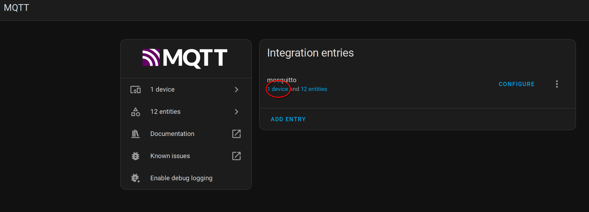
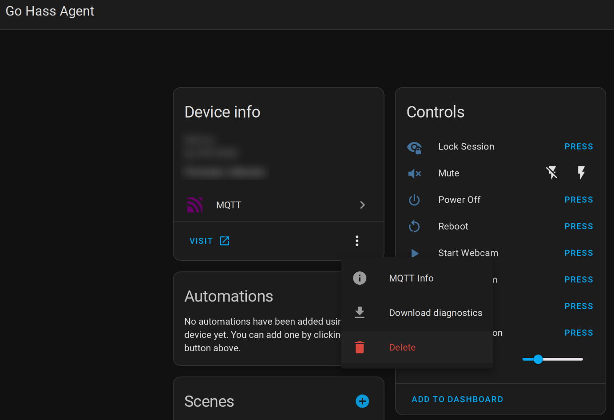

# BREAKING CHANGES

- [BREAKING CHANGES](#breaking-changes)
  - [v10.0.0](#v1000)
  - [New preferences file location and format](#new-preferences-file-location-and-format)
    - [What you need to do](#what-you-need-to-do)
  - [Log file location normalisation](#log-file-location-normalisation)
    - [What you need to do](#what-you-need-to-do-1)
  - [Power controls renaming and consolidation (when using MQTT)](#power-controls-renaming-and-consolidation-when-using-mqtt)
    - [What you need to do](#what-you-need-to-do-2)

## v10.0.0

## New preferences file location and format

The agent preferences file (`preferences.toml`) location has changed. The
configuration is now located in `~/.config/go-hass-agent/`.

The format of the file has changed as well and the format is now prettier TOML.

While these changes will require re-registering ([see
below](#what-you-need-to-do)) after upgrading, existing sensors created by the
agent and their data in Home Assistant should not be affected.

### What you need to do

For existing users, you will need to re-register Go Hass Agent with your Home Assistant instance.

To re-register:

1. Stop Go Hass Agent if already running.
2. Open your Home Assistant ***mobile_app*** integrations page:

  

3. Locate the entry for your existing Go Hass Agent device. It should be named
   the same as the hostname of the device it is running on.
4. Click on the menu (three vertical dots) at the right of the entry:

5. Choose **Delete**.
6. Follow the [first-run instructions](../README.md#-first-run) in the README to re-register the agent.
7. Once the agent has successfully re-registered, you can remove the old configuration directory and its contents. The old location will be `~/.config/com.joshuar.go-hass-agent.debug`.

> [!IMPORTANT]
> If you previously configured MQTT in Go Hass Agent, you will need
> to [re-enable](../README.md#configuration) that as well.

## Log file location normalisation

The agent will now write to a log file at `~/.config/go-hass-agent/go-hass-agent.log`.

### What you need to do

Previous versions may have written a log file to either `~/.config/go-hass-agent.log` or `~/.config/com.joshuar.go-hass-agent.debug/go-hass-agent.log`. You can delete these files if desired.

If you do not wish Go Hass Agent to write any log file, pass `--no-log-file` when running the agent.

## Power controls renaming and consolidation (when using MQTT)

If you have [enabled MQTT](../README.md#mqtt-sensors-and-controls) in Go Hass
Agent, then you may have some controls for shutting down/suspending the device
running the agent and locking the screen/session of the user running the agent.
These controls have been consolidated and only the controls that are supported
by your device will be shown. Notably:

- On devices running with a graphical environment with `systemd-logind`
  integration (KDE, Gnome), there will be two buttons available for
  screen/session locking (***Lock Session*** and ***Unlock Session***).
- On other graphical environments (Xfce, Cinnamon) there will be a single
  ***Lock Screensaver*** button.
- Previously, buttons for all possible power states were created by Go Hass
  Agent. In this version, only the controls that are supported on your device
  will be available. For example, if your device does not support hibernation,
  this control will not be shown.

Many of these controls have also been renamed, which will change their "entity
id" in Home Assistant and may break existing automations or dashboards that are
using the old values.

### What you need to do

You may have duplicate or non-functional buttons. To fix, you can remove the
MQTT device for Go Hass Agent and restart it. It will automatically re-create
the appropriate entities.

1. Open Home Assistant to the ***MQTT** integration page.

2. Click on the ***devices*** link:

3. Locate and click on the row for the agent.  It should be named the same as
   the hostname of the device it is running on.
4. Click on the menu (three vertical dots) below the device info:

5. Choose **Delete**.
6. Restart Go Hass Agent.
7. The MQTT device for Go Hass Agent should reappear with the correct options.
